# AI Tool Session Explorer

## Introduction

AI Tool Session Explorer is a local, read-only web application for browsing AI coding-agent sessions from popular providers such as GitHub Copilot, OpenAI Codex, Anthropic Claude Code, and Microsoft 365 Copilot. It displays conversations, turns, raw events, token usage, cost usage with plenty of information like surfage, models, projects while keeping all data on the user’s machine. The tool also supports provider-specific source archive export and import, with validation to help protect local files.

## AI Tool Session Tracker

AI Tool Session Explorer provides a convenient way to understand and manage local AI assistant activity. It brings session history from multiple providers into one interface, making it easier to review conversations, inspect token consumption, compare model usage, estimate costs, and organize transcript archives without sending data to the cloud.

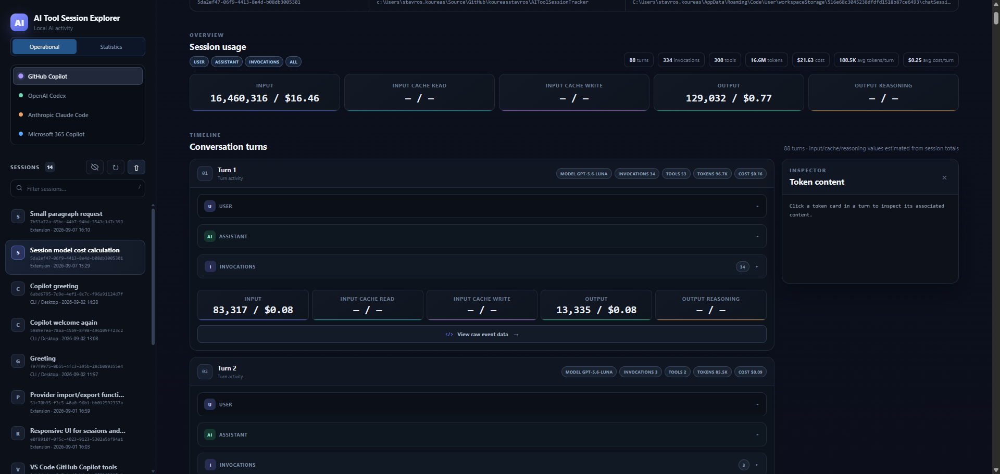

## Select View Mode

The Operational view is designed for exploring individual AI sessions in detail. It shows conversation ids, names, providers, models, projects, timestamps, tokens, costs, turns, raw events, and source files, with options to refresh, filter, delete, import, and export session data. The Statistics view provides an aggregated overview across providers, helping users analyze total sessions, token consumption, estimated costs, and average usage. Data can be grouped by project, day, week, month, year, provider, model, or timeline to make usage patterns and trends easier to understand.

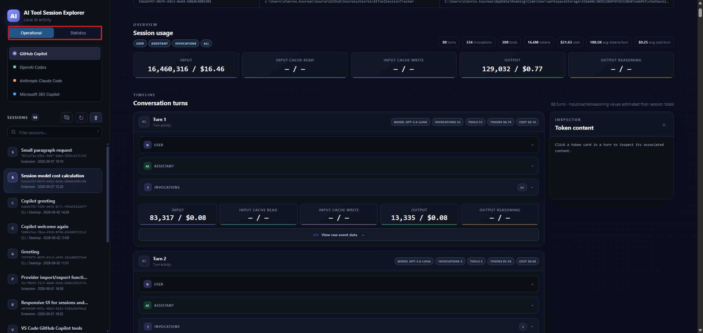

## Select Provider

The Provider Selection menu lets users choose which AI platform’s session data to view, such as GitHub Copilot, OpenAI Codex, Anthropic Claude Code, or Microsoft 365 Copilot. After selecting a provider, the application loads its supported local sessions, displays the relevant storage location, and applies provider-specific parsing, token handling, import, export, and deletion behavior through a consistent interface.

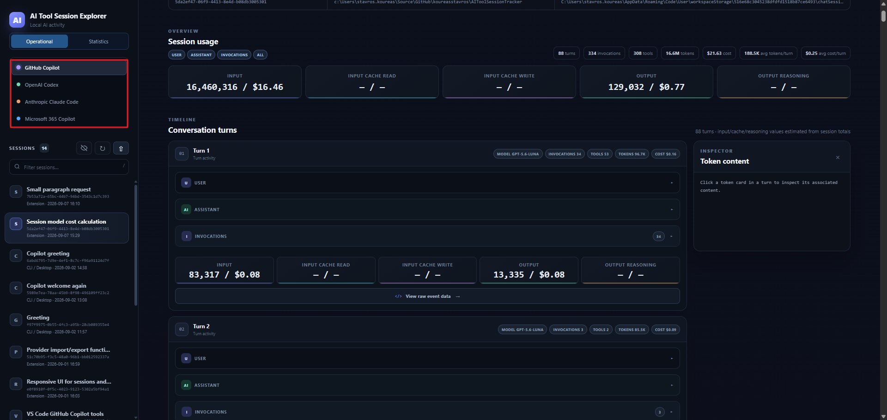

## Select Session

The Session Selection panel lists the conversations discovered for the chosen provider. Each entry displays useful identifying information, such as the session ID or name, source, and last-updated time. Selecting a session opens its detailed view, where users can review conversation turns, token usage, model information, project details, raw events, estimated costs, and available source-file actions.

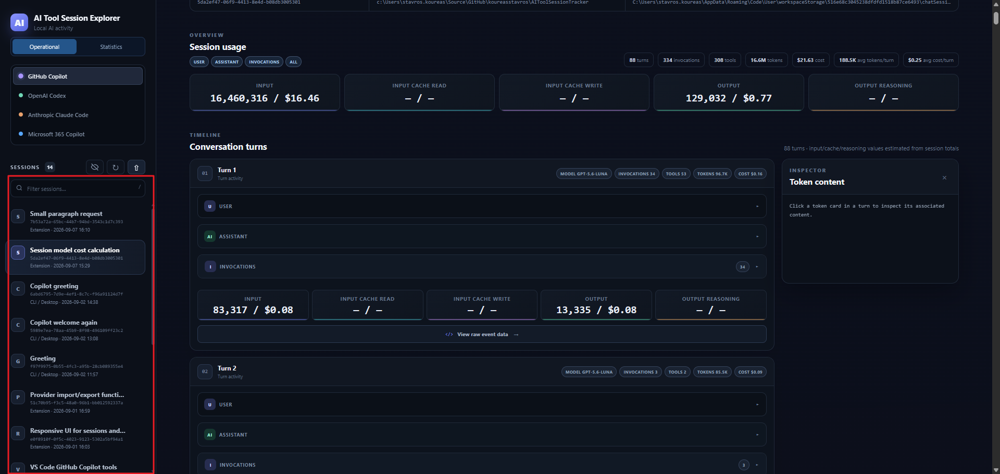

## Item Expand / Colapse

The Expand and Collapse functionality helps users manage the amount of information displayed on screen. Users can expand conversation turns, tool events, raw records, and content sections to inspect detailed data, or collapse them to keep the interface organized and focused. Dedicated buttons provide quick controls for opening or closing individual sections, making it easier to navigate long and complex AI sessions.

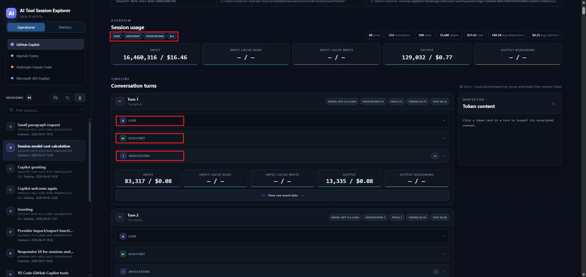

## Session Sections

Each session is organized into clear, structured sections for User, Assistant, Invocation with Tokens, and Cost. The User section displays the original prompt, while the Assistant section presents the generated response. Invocation details show the models used and the associated tool calls and results. Token information summarizes input, cached input, cache writes, output, and reasoning usage, and the Cost section provides an estimated USD value based on the selected model’s local pricing data.

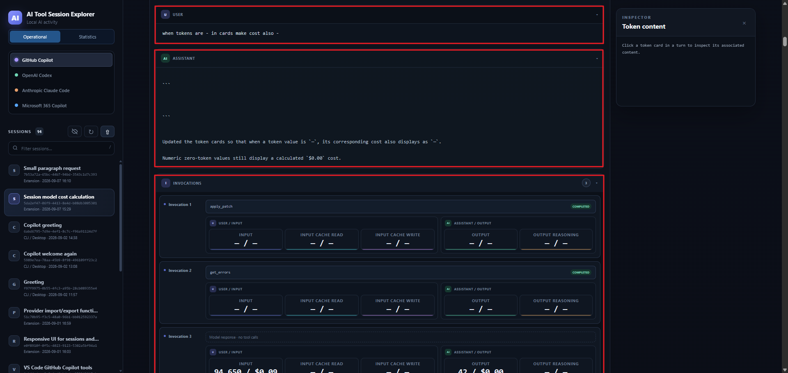

## Session Import / Export

The Import and Export functionality makes it easy to move session source files between environments while preserving their original provider format. Users can export a selected conversation as a ZIP archive containing the original transcript files and a manifest, then import that archive through the provider sidebar. Archives are checked for provider ownership and unsafe paths before files are written, while filename conflicts are handled automatically.

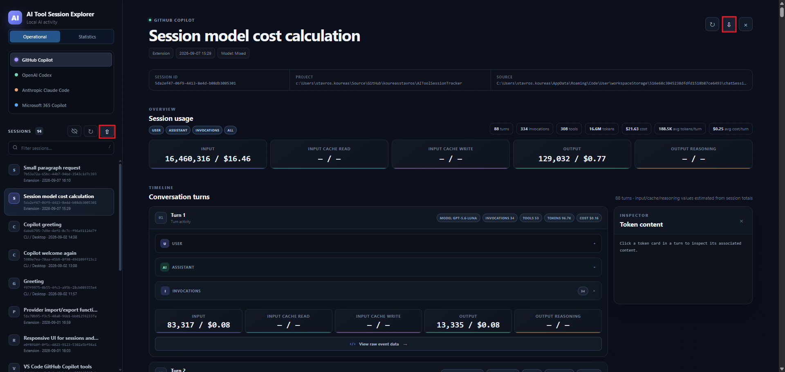

## Drill Down

The Drill-Down functionality connects the Statistics and Operational views. Users can select a project, date, provider, model, or other grouped statistic to see the individual sessions included in that summary. From there, selecting a specific session opens its detailed Operational view, allowing users to move from high-level usage trends to the underlying conversation, token data, costs, and events.

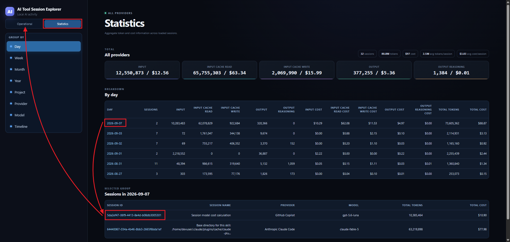

The application also includes additional chart views that visualize token usage and estimated costs over time, making it easier to identify trends, compare activity, and understand AI usage patterns at a glance.

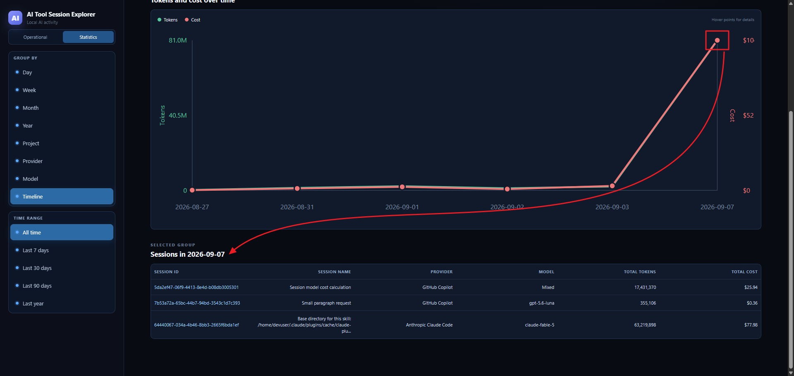

## Refresh Operation

The Refresh function rescans the selected provider’s local storage and updates the session list with newly created, modified, or removed conversations. This makes recent activity available without restarting the application, while preserving the current provider and display preferences where possible.

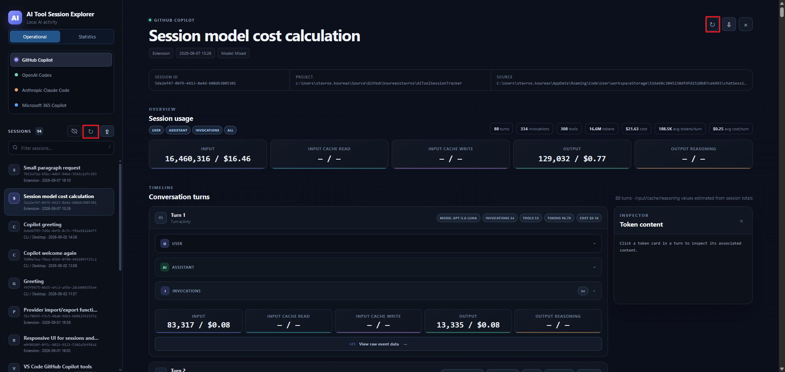

## Delete Operation

The Delete function removes a selected conversation from the provider’s local storage after browser confirmation. The operation uses provider-specific deletion rules, such as removing transcript files, session folders, or related database records. Deletion is local and irreversible through the application, so users should verify the selected session before confirming.

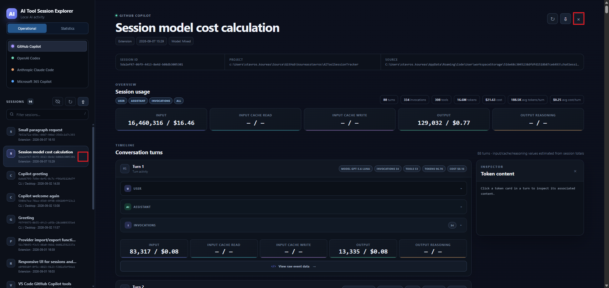