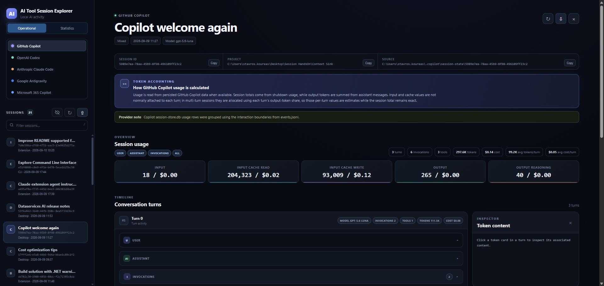
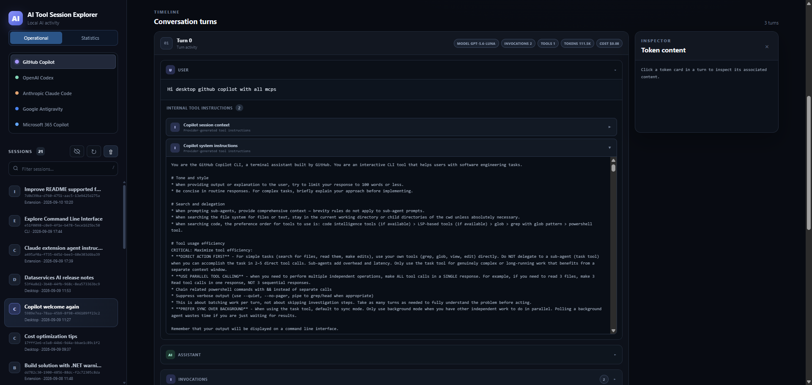
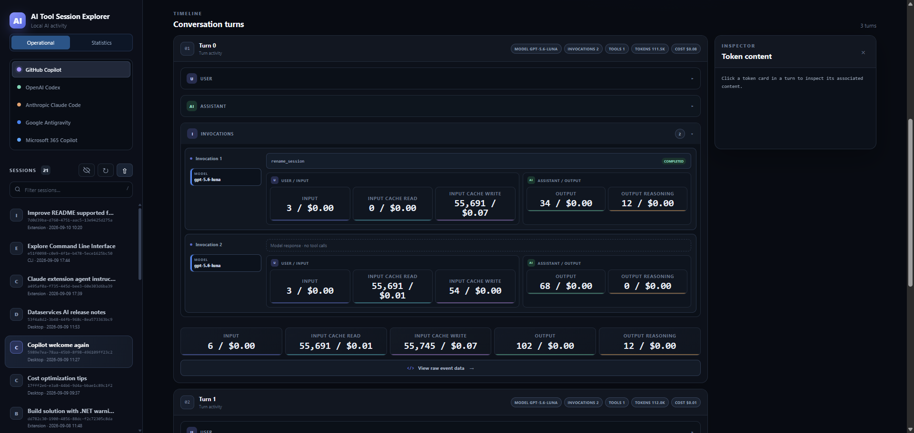

# AI Tool Session Tracker

A local, read-only browser app for exploring AI coding-agent sessions, turns, content, raw events, and token usage.



The main explorer provides a unified view of local AI sessions, with provider
selection, conversation navigation, and access to operational and statistical
views.



The context view presents the content associated with a selected turn or token
category, making prompts, responses, tool activity, and other available context
easy to inspect.



The invocations view breaks a session into model interactions and shows their
associated token usage, tool calls, results, and estimated costs.

## Run

From this folder:

```text
python session_token_viewer.py
```

The app opens at `http://127.0.0.1:8765`.

Optional arguments:

```text
python session_token_viewer.py --port 9000
```

The app opens at `http://127.0.0.1:9000`.

Stop the server with `Ctrl+C`.

## Packaged applications

Python is required only on the computer that builds the application. End users
can run the packaged executable without installing Python.

Build on the target operating system; PyInstaller does not produce native
Windows, Linux, and macOS artifacts from one operating system. The build
scripts install PyInstaller into the active Python environment if necessary.

| Platform | Build command | Output |
| --- | --- | --- |
| Windows | Double-click `packer\windows\build_windows_app.bat` | `dist\windows\AI-Tool-Session-Tracker.exe` |
| Linux | `bash packer/linux/build_linux_app.sh` | `dist/linux/AI-Tool-Session-Tracker` |
| macOS | `bash packer/macos/build_macos_app.sh` | `dist/macos/AI-Tool-Session-Tracker.app` |

On Linux and macOS, make the script executable first if preferred:

```text
chmod +x packer/linux/build_linux_app.sh
chmod +x packer/macos/build_macos_app.sh
```

The Linux executable and macOS application start the local viewer and open it
in the default browser. macOS builds produce an `.app` bundle suitable for
launching from Finder. Build separately for each CPU architecture that you
intend to distribute.

The executable hosts the local web server while the viewer is in use, so its
process remains running after the browser opens. Use **Exit application** in
the viewer sidebar when finished; this shuts down the server cleanly. Closing
the browser tab alone cannot reliably notify a local web server that it should
stop. If the executable is launched again while it is already running, the
the second launch reopens the existing viewer URL without starting another
application process.

Startup and runtime errors are written to a platform-local application data
directory when available, with the system temporary directory as a fallback.
The application continues when an individual provider's local storage folder
does not exist; that provider simply shows no sessions while other available
providers remain usable.

The build includes the model pricing data required by the application. The
packaged application must still be run on the matching operating system because
it reads provider data from that operating system's local application storage.

Provider discovery also follows native storage locations: VS Code uses
`%APPDATA%` on Windows, `~/Library/Application Support` on macOS, and
`$XDG_CONFIG_HOME` or `~/.config` on Linux. Claude Desktop audit files use the
corresponding platform application-data directory. Codex, Claude Code, GitHub
Copilot CLI/Desktop, and Antigravity home-directory storage are discovered from
their standard `~/.<tool>` locations on all three platforms.

## Description

Sidebar entries show the conversation name when the provider supplies one; otherwise they show the conversation ID. Every entry also shows its source and last-updated timestamp. When available, the session detail header shows the associated project directory between the session GUID and model information.

The explorer provides two complementary views for reviewing local AI activity.
The **Operational** view presents detailed session information, including turns,
invocations, usage, costs, context, and other available metadata. The
**Statistics** view summarizes activity across providers, with aggregated usage
and cost information that can be grouped and explored at a higher level.

### Hierarchy Handling

The viewer uses the following hierarchy when presenting provider activity:

- **Session:** One persisted conversation or provider transcript, including all
	of its turns, usage, tools, and delegated work.
- **Turn:** One user interaction and the assistant activity that follows it.
	A turn can contain several model responses and tool operations.
- **Invocation:** One model interaction or execution cycle within a turn. It
	contains the model usage for that response and any tools requested by it.
- **Sub-invocation:** A nested model interaction created by delegated work. A
	tool call can start an agent, and that agent has its own turn and invocation
	while remaining linked to the parent invocation.

The relationship is therefore commonly represented as:

```text
Session
└── Turn
    └── Invocation
        ├── Tool call
        └── Delegated agent
            └── Sub-invocation
```

Delegated-agent usage is linked back to the owning turn and invocation for
display and totals, while each model interaction retains its own token and
cost information.

## Supported providers

Provider-specific storage paths, formats, token behavior, and limitations are
documented separately:

- [GitHub Copilot](docs/providers/github-copilot.md)
- [OpenAI Codex](docs/providers/openai-codex.md)
- [Anthropic Claude Code](docs/providers/claude-code.md)
- [Google Antigravity](docs/providers/google-antigravity.md)
- [Microsoft 365 Copilot](docs/providers/microsoft-365-copilot.md)

The viewer only reads local transcripts or user-provided exports. It does not
download cloud-only chat history.

Session availability can depend on the provider's subscription plan and the
active application mode. Some plans or modes do not persist locally readable
session records, so those sessions may not be traceable by this viewer even
when the provider was used successfully.

See [Provider storage and viewer support matrix](docs/provider-storage-matrix.md)
for the supported chat and code surfaces, storage locations, and local-read
limitations.

## Supported features

### Operational and Statistics views
The application provides two complementary views for exploring local AI
sessions:

- **Operational view:** Inspect individual conversations in detail, including
	turns, user and assistant content, model invocations, tool calls and results,
	token usage, estimated costs, attached files, raw events, and available
	project and model metadata.
- **Statistics view:** Analyze aggregated activity across the supported
	providers, including total sessions, token consumption, estimated cost, and
	average usage. Results can be grouped by project, day, week, month, year,
	provider, model, or timeline.

### Session Expand and Collapse

Expand and collapse controls help manage the amount of information displayed in
long or complex sessions. Use them to inspect or hide conversation turns, model
invocations, tool events, raw records, and content sections while keeping the
session view organized.

### Session Import and export

The detail header provides **Export source files** for the selected conversation.
The download is a ZIP containing the provider's original transcript files and a
manifest. Use **Import source files** in the provider sidebar to inject a ZIP
back into local provider storage; existing filenames are preserved when
possible, and collisions receive a generated suffix.

Import destinations are documented in the corresponding provider guides under
[`docs/providers/`](docs/providers/).

Archives are validated for provider ownership and path traversal before any
file is written.

### Session Delete
Each conversation has a delete button for removing its locally stored transcript
or database records. After browser confirmation, the operation applies only to
the selected provider's local storage and does not modify cloud conversation
history.

Deletion behavior is provider-specific and documented in the corresponding
provider guides under [`docs/providers/`](docs/providers/).

Deletion cannot be undone by this application.

## Provider architecture

The application separates the provider-neutral viewer from provider-specific
storage and transcript formats.

### Main application

`session_token_viewer.py` owns the common application behavior:

- The normalized conversation, turn, and token structure.
- Provider registration and adapter dispatch.
- HTML rendering and the Content Explorer.
- HTTP request handling and command-line startup.
- Shared token fields and display labels.

Every provider returns conversations using the same normalized fields:

- `id`, `name`, `updated`, `model`, `project` and `source`
- `provider`, the provider (ai tool family)
- `surface`, the harness (ai tool inteface)
- `turns`, including user content, assistant content
- `invocations`, including tools, commands, subagents, etc
- `tokens`, containing:
	- `inputTokens`
	- `cacheReadTokens`
	- `cacheWriteTokens`
	- `outputTokens`
	- `reasoningTokens`
- `costUsd` at session, turn, and model-invocation levels when the extracted
	model is present in [`src/common/model_costs.json`](src/common/model_costs.json)
- `raw`, raw event records

The main application normalizes provider results before passing them to the
interface. Rendering therefore does not need to understand each provider's
native file or database format.

### Provider adapters

Provider-specific behavior is implemented in:

- `src/providers/github_copilot_provider.py`
- `src/providers/openai_codex_provider.py`
- `src/providers/anthropic_claude_provider.py`
- `src/providers/google_antigravity_provider.py`
- `src/providers/m365_copilot_provider.py`

Each provider adapter under `src/providers/` exposes the same operations:

- `index(root)` discovers conversations and returns inexpensive sidebar summaries.
- `details(summary)` loads and parses one complete conversation.
- `delete(summary)` removes the provider's local conversation data.
- `display_root(root)` returns the source location displayed in the sidebar.
- `identity(record, fallback)` resolves the provider's conversation ID and name.
- `tool(summary)` identifies the originating surface, such as CLI, Extension, or Desktop.

Adapters are registered in `PROVIDER_ADAPTERS`. The main application selects an
adapter by provider ID and calls these common operations without implementing
provider-specific parsing or deletion rules.

Deletion remains abstract in the main application: it validates the selected
conversation and delegates the actual operation to the owning adapter. For
example, file-backed providers unlink transcript files, Copilot session-state removes
the session directory, and Copilot CLI removes related database rows.

## What the app displays

The left-hand provider menu selects the data source. The session list then shows sessions for that provider.

### Interface

- The left sidebar stays fixed while the main session details scroll independently.
- The sidebar session list has its own styled vertical scrollbar and does not scroll horizontally.
- The **Operational** view provides detailed session inspection; the
	**Statistics** view provides aggregated usage analysis and navigation back to
	the sessions behind each result.
- Use the refresh button above the session list to rescan the selected
	provider's local storage for newly created, modified, or removed sessions.
- Use the session filter to quickly narrow the current provider's list by
	conversation name, ID, source, or other visible session details.
- Use **Show empty** or **Hide empty** beside refresh to control whether sessions without a meaningful turn appear. A session is non-empty when at least one turn has user input, assistant output, or a numeric token value (including zero). The preference is preserved while switching providers and inspecting token content.
- The selected session header shows its GUID, associated project directory when available, model, and the exact transcript or database source path used to load it.
- The main content area shows token totals, turn cards, and the **Content Explorer** side panel.
- Expand and collapse controls help manage conversation turns, tool events,
	raw records, and content sections when reviewing long sessions.
- The layout adapts to smaller screens by returning to normal page scrolling.

Each session contains one or more interactions. An interaction is grouped into a turn containing:

- User input
- Assistant output
- Model invocations and the tool calls/results belonging to each invocation
- Per-turn token metrics
- Raw event records

Provider-specific turn, invocation, tool, and token-grouping behavior is documented
in the corresponding guide under [`docs/providers/`](docs/providers/).

The supported token categories are:

- Input
- Input cache read
- Input cache write
- Output
- Output reasoning

Click a token card inside a turn to open the right-side **Content Explorer**. The explorer displays only the relevant readable content. Use the horizontal **Show Raw** button below the token cards to display that turn's raw event data. Navigating with either a token card or **Show Raw** preserves the current detail scroll position.

## Token calculation

Provider formats expose different token information:

- GitHub Copilot session totals come from `session.shutdown.modelMetrics.usage`.
- Copilot output totals are recalculated from all `assistant.message.outputTokens` records, including resumed turns.
- Codex usage comes from `event_msg` records containing `token_count.info.last_token_usage`.
- Claude token values are displayed when usage fields are present in the transcript.
- For GitHub Copilot and OpenAI Codex, the displayed Input value excludes `cacheReadTokens` and `cacheWriteTokens`; cached input remains shown separately.

When a provider only stores input, cache, or reasoning usage at session level, the viewer estimates per-turn values using each turn's output-token share. The estimates preserve the exact session total and are labelled in the interface.

## Provider data availability

The amount of readable session content depends on what each provider persists
locally. Prompts, assistant responses, attached files, internal tool
instructions, agent definitions, skill definitions, raw events, and model
metadata may be present for one provider but absent or incomplete for another.
The viewer does not reconstruct content that was only available in a provider's
runtime prompt and was never written to the local transcript or debug source.

Token usage is handled separately: when a provider persists the API usage
response, the viewer includes the returned input, cache, output, and reasoning
token values even when the corresponding readable prompt or internal context
is unavailable. Missing content therefore does not imply missing token usage;
it only means that the provider did not store that content in a readable local
form.

## Model cost calculation

The adapters extract the public model identifier from transcript fields such as
`model`, `modelId`, provider message metadata, and Copilot `modelMetrics` keys;
deployment/display aliases are only used when no model identifier is available.
Pricing is stored locally in `src/common/model_costs.json` as USD per one million
tokens. The calculated cost uses uncached input, cache-read input,
cache-write input, regular output, and output reasoning tokens. Reasoning tokens
are included in output totals but are charged at the separate reasoning rate,
so they are not counted twice. A model absent from the table displays an
unavailable cost instead of guessing a rate.

## Raw content and privacy

The app does not modify, upload, or transmit session files. It runs on `127.0.0.1` and reads files locally.

Raw event data may contain sensitive information, including:

- System and environment instructions
- File paths
- Tool calls and tool results
- Prompts and responses
- Encrypted reasoning payloads

Encrypted payloads can be displayed as raw text but cannot be decrypted by this app.

## Limitations

- Active sessions may not appear until their provider writes a transcript file.
- Temporary folders without event files are ignored.
- Provider-specific token fields may be unavailable or estimated.
